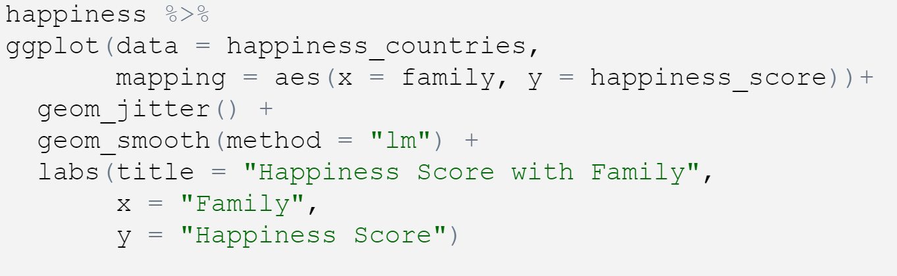
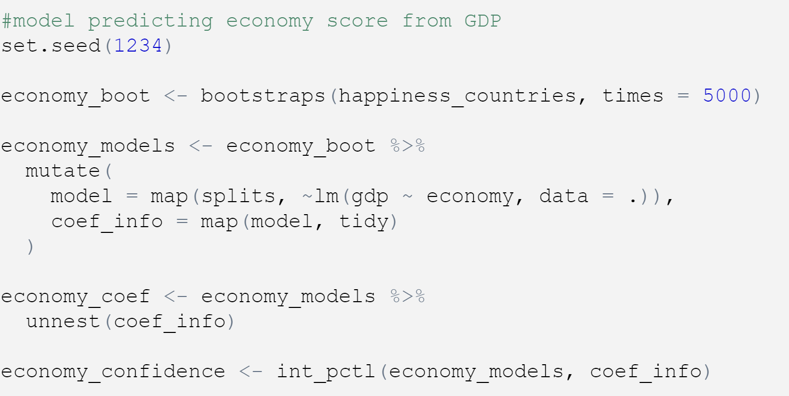

## Research Question

The research question we will be investigating is, 'How  Do a Range of Factors Affect Worldwide Happiness?'. 

It is of interest as it informs and develops an understanding of global wellbeing and development. It focuses on current issues and standards of countries internationally. 

## Hypothesis 

We hypothesise that in countries with higher GDP and freedom rating , the happiness score will be higher than countries with a lower GDP and freedom rating. Therefore the GDP and Freedom Rating  are proportional to the happiness score.

We hypothesise that in countries where Government Corruption is higher, the happiness score will be lower than in countries with less government corruption. Therefore government corruption and happiness score will vary inversely with each other.

## What is the Ranking?

A report based on national happiness, based on citizen ratings of their lives, it correlates results on a number of factors. 

## Data

The dataset we have used is the 2015, World Happiness Ranking. (.csv file)

(Author- Sustainable Development Solutions Network, 2019, _World Happiness Report_, Electronic Dataset, Accessed- 21.10.22, <https://www.kaggle.com/datasets/unsdsn/world-happiness>)

The key variables we will be using are;

- Government Trust, perception of corruption

- Economy, in terms of GDP of the country

- Family

- Freedom 

- Health, the expected life expectancy of the citizens,

and the resulting variable of Happiness Score. 


Another dataset we left joined with our 2015 set was the 'countries of the world' dataset.

(Author- Fernando Lasso, 2017, _Countries of the World_, Electronic Dataset, Accessed- 10.11.22, <https://www.kaggle.com/datasets/fernandol/countries-of-the-world>)

## Findings

**Method**

After analysing our dataset and how different variables can be used we decided to find another data set, _Countries of the World_, and use a left join to join it with our _2015 Happiness Set_. By doing this we have more variables for each individual country, such as population, coast line and population density. We noticed some of our countries had NA values, to resolve this we renamed some of the countries in the _Countries of the World_ dataset, so that they would match up with the _2015_ format of each country. 

We made 5 scatter graphs to show how each of our chosen variables varied with the Happiness Score. To which we then added a linear regression model.

**Findings**

The Model

-	We created a model predicting different variables from their score, we used bootstrapping to increase the confidence level in our results. 
-	The results we obtained were, 
-	We are 95% confident that for each additional 0.1 of a point of economy score, we would expect GDP to increase by $1734.00 to $2390.46, on average.
-	We are 95% confident that for each additional 0.1 of a point of health score, we would expect infant mortality to decrease by 9637.09 to 14180.66, on average.
-	We are 95% confident that for each additional  1 phones per 1000 people, we would expect the happiness score to increase by  0.90 to 2.56, on average. Although this model was shown as unreliable as when compared to the graph output we can see that there is very little correlation between the phones and happiness ranking. 

Average Happiness Score

- Our calculations have found that the average happiness score of our rated countries is 5.375734 out of a possible 10. This is on a range from highest to lowest, (Switzerland to Togo).

Region Results 

- The graph we made for showing where each regions countries lie in terms of their Happiness Rank. It has shown that some Regions have stronger range positioning than others. Western Europe generally has higher ranking countries. This could be because a high number of the Western European countries, such as Norway, Germany and Denmark, are considered as developed countries (external source 2). Whereas Sub-Saharan Africa has a generally lower ranking of countries. Niger, the Central African Republic and Chad, each are considered the most under developed countries in the world (external source 2), all of which are located in Sub-Saharan Africa. 

- These trends will be typically true throughout each region, aside from a few outliers, to which there will be other factors making a variance. 

Graph 1: Family vs Happiness Score 

- Our scatter plot has a positive linear correlation, where the association between points is quite strong. Where generally as the Happiness Score increases the Family rating increases to. There are few outliers from the general trend. 

Graph 2: Freedom vs Happiness Score 

- Our scatter plot has a positive linear correlation, but this one is not as strong in its connection as there is more variance between points. There are some outliers, but also a weaker line of best fit. 

Graph 3: Health vs Happiness Score 

- The graph again has a positive linear correlation. More of the outliers are located in the lower happiness scores. Where some of the lower health rating have a higher happiness ranking, we believe this is most likely due to the fact that not one factor have the main impact. 

Graph 4: Government Trust vs Happiness Score

- With this graph there is more of a cluster of points in the lower trust rating, implying that trust is lacking in more countries. 

Graph 5: Economy vs Happiness Score 

- This graph shows a strong, linear, positive correlation between the variable and score. This variable is more directly proportional than some others. 

Graph Connections 

- Where some outliers are shown means that no one variable has an entire effect on the Happiness Score and different variables need to be put together as they aren't related to each other. e.g. where one may has a high family rating they may have a lower rating in another variable, determining a change in their overall ranking. 

**Evaluation**

Limitations:

- How many and who was surveyed for the results. 

- Somewhat indefinite variables as they are dependent on who was asked for the results. 

- World circumstances, such as war, natural disaster and social circumstances can effect the results given by citizens.

- An individual countries development in the world in terms of economical, social and political factors. This can also make an effect on the citizens but the dataset doesn't take these factors into consideration. 

- Our leading dataset is from 2015, and is therefore seven years old (from 2022), the results may me out of data and different countries could be making developments on the scale. The joined dataset is from 2017 (five years ago), when compared to each other the two year gap will be incorrect for some variables such as population, which may have had growth in the time. 

Resulting Evaluation:

- Our first hypothesis was that 'countries with higher GDP and freedom rating, the happiness score will be higher than countries with a lower GDP and freedom rating'. We confirm that this is true, as it was shown in the resulting scatter graphs, although the graph does not show them to be directly proportional as the graph does not have a distinct straight line. Our reasoning for this is that some countries have a large number of people in poverty and then higher numbers of the richest people worldwide, known as wealth inequality. 
A country such as South Africa which has a happiness ranking of 113, has also been ranked as one of the countries with the Highest Wealth Inequality (external source 1)
- The next factor from the hypothesis was freedom, for our scatter graph we see that there is a similar pattern as the last factor although not as definitive, therefore although our hypothesis is true the link between the factors is not as strong as we thought it would be. This data analysis gave us a different perspective as the outcome we expected differed from our original idea. 

- High levels of inequality tends to lead to low level of wellbeing and life satisfaction in developed countries. But for developing countries they tend to have more complicated relationships between happiness and inequality. People in less equal countries are less likely to believe that most people can be trusted and less interest in politics. They are more likely to believe that there needs to be more respect for authority, they can also be more likely to think that children should be independent rather than obedient. 

- Our final hypothesis was that 'countries where Government Corruption is higher, the happiness score will be lower'. The trust variable involves the amount of government corruption experienced in each individual country. We created a graph with the variables happiness score and trust. The findings of this graph agree with the original hypothesis but there was some variance as the trend was not as extreme as we originally expected. As government corruption decreased, the happiness score increases but the gradient line, given by geom smooth, was not as steep as we had foreseen.

- All of our hypothesis were correct but only one was as certain as we had expected, therefore our data analysis added value to the dataset as it was able to show some unanticipated results. 


**Example of our Model and Code **

This is an example of the code we have used to design our plots, this conveys how the ratings of Family vary with the overall Happiness Score. We decided to display them as a jitter plot as many point were close together and over lapping so the jitter adds a some variance. The Smooth adds a linear trend line through the points. 

```{r echo=FALSE}

```

The following model is predicting the Economy Score from the countries GDP. We used a bootstrap to estimate a parameter from our sample. To ensure that the data we used was a more accurate depiction of the countries and its ranking. 

```{r echo=FALSE}

```


## Presentation

Our presentation can be found [here](presentation/presentation.html).


## References

Dataset 1 -

(Author- Sustainable Development Solutions Network, 2019, _World Happiness Report_, Electronic Dataset, Accessed- 21.10.22)

<https://www.kaggle.com/datasets/unsdsn/world-happiness>

Dataset 2 - 

(Author- Fernando Lasso, 2017, _Countries of the World_, Electronic Dataset, Accessed- 10.11.22)

<https://www.kaggle.com/datasets/fernandol/countries-of-the-world>

External Source 1 - 

(2022, _Wealth Inequality by Country 2022_, Electronic Web Source, Accessed- 25.11.22)

<https://worldpopulationreview.com/country-rankings/wealth-inequality-by-country>

External Source 2 - 

(2022, _Developed Countries List 2022_, Electronic Web Source, Access- 29.11.22)

<https://worldpopulationreview.com/country-rankings/developed-countries>